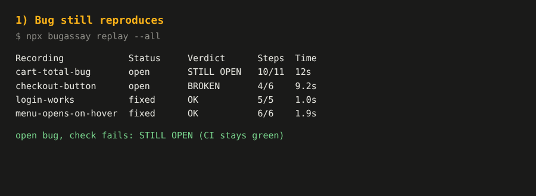
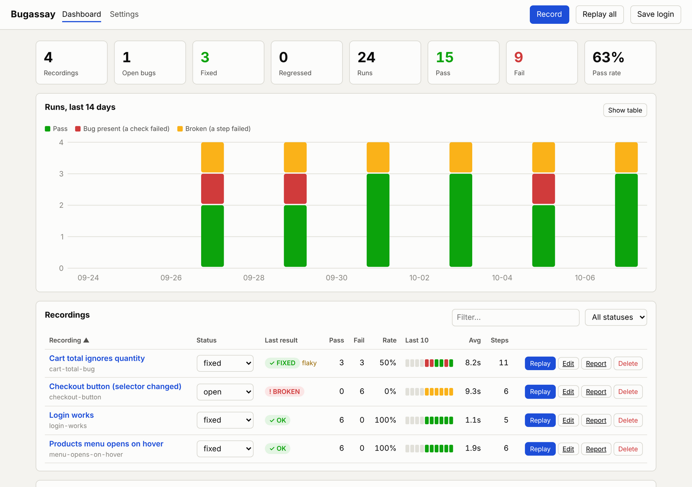
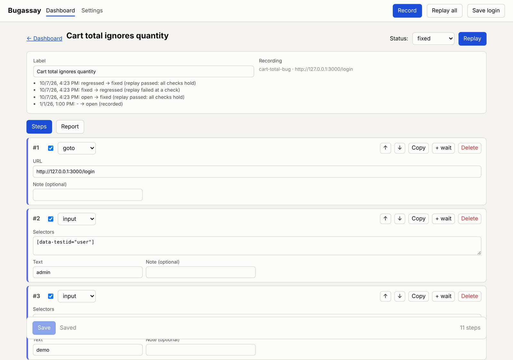

# Bugassay

**Record a browser bug once. Replay it anywhere.**

Bugassay records a manual bug reproduction (clicks, typing, hover menus, checks) and replays it deterministically with Playwright. Each recording has a **bug lifecycle**, so you can see which bugs are open, fixed, or have come back. Results are tracked in a dashboard and can fail your CI.

- CLI + local web UI (dashboard and step editor)



> Status: v2.0. Unit tests pass and an end-to-end test (demo shop, real Chromium) covers open -> fixed -> regressed. Replay, the lifecycle and the UI are tested against the demo shop. The recorder (`record`) was not part of that test run, and nothing has been tried on real-world apps yet, so expect rough edges and please open an issue when you find one. Tested on Linux with Node 22.

## Install

Requires Node.js 20+.

```bash
git clone https://github.com/melihkl/bugassay.git
cd bugassay
npm install
npx playwright install chromium     # or set "browserPath" in config.json to your Chrome/Edge
```

## Try it with the demo shop

```bash
npm run demo                 # terminal 1: shop with a cart-total bug on http://localhost:3000
npm run demo:seed            # terminal 2: copies a sample recording
npx bugassay replay --all    # -> STILL OPEN (the bug reproduces)
# stop the demo, start it with the bug fixed:
DEMO_FIXED=1 npm run demo
npx bugassay replay --all    # -> FIXED, status changes open -> fixed automatically
```

## Daily use

Settings live in `config.json` (created on first use; see `config.example.json`). Nothing is asked in the terminal.

```bash
npx bugassay login          # optional: save a logged-in session (session.json)
npx bugassay record         # opens "url"; close the window to finish
npx bugassay replay         # last recording (or a number / name)
npx bugassay replay --all   # every open / fixed / regressed recording
npx bugassay ui             # dashboard + step editor (http://127.0.0.1:4300)
npx bugassay list | stats | status | report | generate | jira | doctor
```

Add **checks** while recording with the REC toolbar at the bottom-right of the page (Assert text / visible / URL, Add hover). A check describes the *correct* behaviour: when all steps and checks pass, the bug is gone.

## Bug lifecycle

| Status | Meaning |
|---|---|
| `open` | known bug, should still reproduce |
| `fixed` | fixed; the recording guards against it coming back |
| `regressed` | a fixed bug came back |
| `wontfix` | skipped by `replay --all` |

| Verdict | When | CI |
|---|---|---|
| FIXED | open bug, everything passes (status becomes `fixed`) | ok |
| OK | fixed bug, everything passes | ok |
| STILL OPEN | open bug, a check fails | ok (fails with `--strict`) |
| REGRESSION | fixed bug, a check fails (status becomes `regressed`) | **fail** |
| BROKEN | a non-check step failed: the script needs maintenance | **fail** |
| UNVERIFIED | all steps pass but there is no check | ok (fails with `--strict`) |

Automatic status changes can be turned off with `"autoStatus": false` or `--no-auto-status`. Change a status by hand: `npx bugassay status <recording> fixed`.

## replay --all in CI

```bash
npx bugassay replay --all --parallel 2 --junit junit.xml --json results.json
```

Options: `--status open,fixed` | `--filter text` | `--bail` | `--strict` | `--verbose` | `--headed`. Exit code is 1 on REGRESSION or BROKEN (and with `--strict` also STILL OPEN / UNVERIFIED). Replay runs hidden by default in this mode.

## Dashboard and editor (`npx bugassay ui`)



- KPIs, 14-day pass / bug present / broken chart (with table view), per-recording pass and fail counts, pass rate, last-10 results, average time, flaky marker, recent runs, "Replay all".
- Step editor: edit, enable or disable, reorder, duplicate, delete and add steps, add `wait` steps and checks, edit selector candidates. Saving keeps a `bug.json.bak` backup.



## Files

```text
bugassay-recordings/<recording>/
├── bug.json            the recording (docs/recording-format.md)
├── runs.json           run history (last 100)
├── replay.json         last result
├── report.html, start.png, final.png, console.log
└── replay-steps/, replay.webm, replay-fail-*.png
```

## Security

Typed values, including passwords, are stored as typed, and `session.json` contains login cookies. Keep them private; `.gitignore` already excludes them. The UI listens on `127.0.0.1` only, uses a per-start token and a strict CSP. See SECURITY.md.

## Limitations

Single tab, top frame only (no iframes, popups). Hover menus with unusual mouse-speed rules may need a larger `hoverWait` or `delay`.

## License

MIT, see LICENSE.
